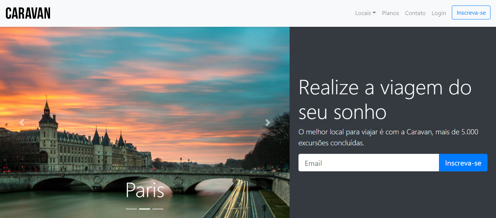

## CARAVAN

Project created for a travel company. The idea of ​​the project was to practice concepts learned in bootstrap, such as grid, code organization and how to gain more agility during project development using the bootstrap framework.

## 🚀 Technologies :

**Front-end:** BOOTSTRAP;

## 💻 How to use :

Project Link : https://project-caravan.vercel.app/

## 👨 Author :

[@jhonathanSousa](https://www.linkedin.com/in/jhonathan-alves-sousa/)

