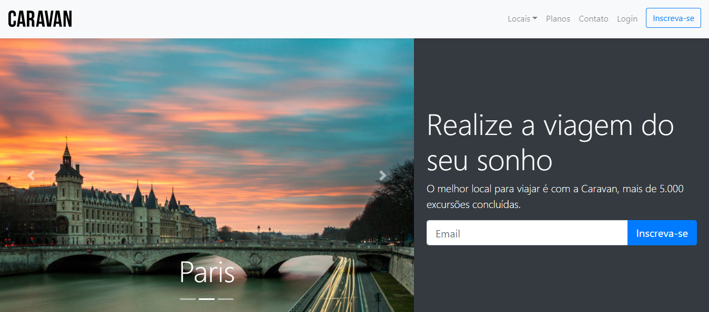

## 💻 Sobre o projeto Caravan

Projeto criado para uma de empresa de viagens.A ideia do projeto foi praticar conceitos aprendidos no bootstrap, como grid , organização do código e como ganhar mais agiliidade durante um desenvolvimento do projeto utilizando um framework como o bootstrap.

